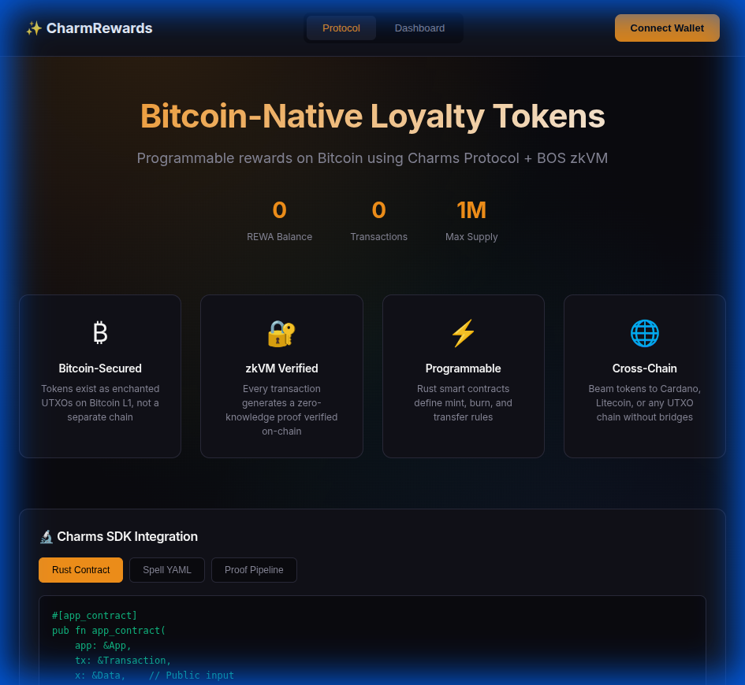
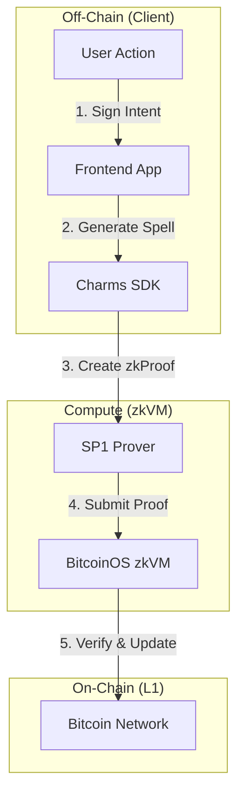

# CharmRewards ✨

> **Bitcoin-Native Loyalty Token Platform** powered by [Charms Protocol](https://charms.dev)

Programmable loyalty tokens on Bitcoin. Earn, redeem, and transfer tokens — all secured by zkVM proofs on Bitcoin UTXOs.



## 🏆 Hackathon Alignment

**Mission: Make Bitcoin Programmable**
CharmRewards directly addresses the mission by bringing complex loyalty logic (minting, burning, tiered rewards) to Bitcoin without sidechains or bridges.

| Criteria | Implementation in CharmRewards |
| :--- | :--- |
| **SDK First** | Built using `charms-sdk` 0.10, utilizing standard `app_contract` patterns. |
| **Working UI** | Complete React dashboard with Xverse/Unisat wallet integration. |
| **Core Feature** | **zkBTC Loyalty**: Tokens are real UTXOs that change state based on ZK proofs. |
| **Innovation** | Demonstrates "Burn-to-Redeem" pattern proving ownership without revealing identity. |

## 🏗 Architecture

The system uses a **Prover-Verifier** model where user actions generate proofs verified by the BitcoinOS zkVM.



### Protocol Flow
1.  **Minting**: Merchant authorizes new tokens -> Proof ensures `supply <= max_supply`.
2.  **burning**: User burns tokens for reward -> Proof ensures `balance >= cost`.
3.  **Transfer**: User sends tokens -> Proof ensures `sum(inputs) == sum(outputs)`.

## ✨ Features

- 🔗 **Wallet Connection** — Xverse, Unisat, Leather support
- ⚡ **Gamification** — Streaks, achievements, live leaderboard
- 🎰 **Daily Rewards** — Spin wheel + daily bonuses
- 🚀 **Cross-Chain Ready** — Built on standard UTXO models compatible with Cardano/Litecoin
- 🔬 **Dev Mode** — Real-time visualization of the ZK proof pipeline

## 🚀 Quick Start

```bash
# 1. Clone & Install
cd frontend
npm install

# 2. Run Development Server
npm run dev
# Opens http://localhost:5173
```

## 🔮 Future Roadmap

- [ ] **Merchant Portal**: No-code interface for brands to launch their own tokens.
- [ ] **Cross-Chain Bridge**: One-click "beam" to move loyalty points to Liquid sidechain.
- [ ] **Privacy Pools**: ZK-shielded transfers so competitors can't track brand volume.

## 🛠 Tech Stack

- **Contracts**: Rust, Charms SDK
- **Frontend**: React, Vite, Framer Motion
- **Wallets**: Sats Connect (Xverse), Unisat API
- **Design**: Glassmorphism UI, CSS Modules

---

Built with ❤️ for the **BitcoinOS Hackathon**
