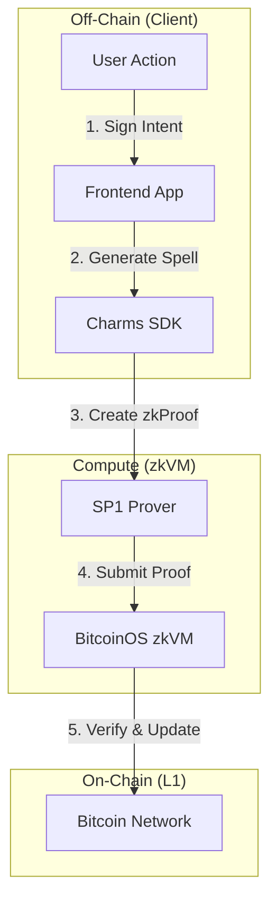

# CharmRewards ✨

> **Bitcoin-Native Loyalty Token Platform** powered by [Charms Protocol](https://charms.dev)

Programmable loyalty tokens on Bitcoin. Earn, redeem, and transfer tokens — all secured by zkVM proofs on Bitcoin UTXOs.

## 🏆 Hackathon Alignment

**Mission: Make Bitcoin Programmable**
CharmRewards directly addresses the mission by bringing complex loyalty logic (minting, burning, tiered rewards) to Bitcoin without sidechains or bridges.

| Criteria | Implementation in CharmRewards |
| :--- | :--- |
| **SDK First** | Built using `charms-sdk` 0.10, utilizing standard `app_contract` patterns. |
| **Working UI** | Complete React dashboard with Xverse/Unisat wallet integration. |
| **Core Feature** | **zkBTC Loyalty**: Tokens are real UTXOs that change state based on ZK proofs. |
| **Innovation** | Demonstrates "Burn-to-Redeem" pattern proving ownership without revealing identity. |

## 🏗 Architecture

The system uses a **Prover-Verifier** model where user actions generate proofs verified by the BitcoinOS zkVM.

# OPUS: Onchain Programmable UTXOs

**OPUS** is a Bitcoin-native protocol demonstrating **App-Specific Rollups** on BitcoinOS.
It enables programmable, stateful assets (Loyalty Tokens, Stablecoins, etc.) that live directly on Bitcoin L1 as UTXOs, but whose state transitions are governed by off-chain zero-knowledge proofs.

## 📐 Architecture

The protocol follows the **Spell -> Proof -> Verification** pipeline:

1.  **Spell (Action)**: User intents (Mint, Burn, Transfer) are serialized into a "Spell" (a compact state transition request).
2.  **ZK-Prover (Off-chain)**: The **Charms SDK** executes the Rust smart contract logic in a zkVM (SP1/Risc0). This generates a ZK proof attesting that the state transition follows the rules (e.g., "Sender has balance", "Supply < Max").
3.  **Verification (On-chain)**: The proof is batched and verified by the BitcoinOS BitSNARK verifier on Bitcoin L1.
4.  **Settlement**: If verified, the Bitcoin UTXO set is updated.

## � Tech Stack

*   **Frontend**: React + Vite + Framer Motion (Glassmorphism UI)
*   **Protocol**: BitcoinOS (BitSNARK verification)
*   **Contract**: Rust (Charms SDK)
*   **Wallet**: UniSat / Xverse (BIP-322 / PSBT)

## 🚀 Live Demo (Testnet4)

The application is deployed on Bitcoin Testnet4.
*   **Mint**: Creates a new UTXO with embedded `OPUS` state.
*   **Burn**: Consumes the UTXO to redeem a reward, enforcing the "Burn" constraint in the contract.

## 📂 Project Structure

*   `frontend/`: React application with real-time ZK debugger visualization.
*   `charm-app/`: Rust smart contract logic defining the constraint system.

## 🔮 Future Roadmap

- [ ] **Merchant Portal**: No-code interface for brands to launch their own tokens.
- [ ] **Cross-Chain Bridge**: One-click "beam" to move loyalty points to Liquid sidechain.
- [ ] **Privacy Pools**: ZK-shielded transfers so competitors can't track brand volume.

## 🛠 Tech Stack

- **Contracts**: Rust, Charms SDK
- **Frontend**: React, Vite, Framer Motion
- **Wallets**: Sats Connect (Xverse), Unisat API
- **Design**: Glassmorphism UI, CSS Modules

---

Built with ❤️ for the **BitcoinOS Hackathon**
