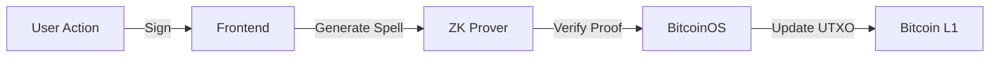

# OPUS: Onchain Programmable UTXOs

**OPUS** is a Bitcoin-native protocol demonstrating **App-Specific Rollups** on BitcoinOS.
It enables programmable, stateful assets (Loyalty Tokens, Stablecoins, etc.) that live directly on Bitcoin L1 as UTXOs, but whose state transitions are governed by off-chain zero-knowledge proofs.

## 💎 Key Features
 
**1. Programmable UTXOs (SDK First)**
Built efficiently with **Charms SDK v0.10**, OPUS enables standard Bitcoin UTXOs to carry complex state (balances, tiers, history) without bloating the chain.
 
**2. Zero-Knowledge Logic**
All transaction rules (Mint/Burn) are enforced by **Rust Smart Contracts** executing in a zkVM. The blockchain verifies the *proof* of correctness, not the execution itself, allowing for infinite scalability.
 
**3. Native User Experience**
A fully functional React dashboard that feels like a modern web app but interacts directly with Bitcoin L1 via Xverse and Unisat. No bridges, no wrapped tokens.
 
**4. Real-World Utility**
Solves the "Loyalty Fragmentation" problem by turning points into interoperable Bitcoin assets that users actually own.

## 📐 Architecture

The protocol follows the **Spell -> Proof -> Verification** pipeline:



1.  **Spell (Action)**: User intents (Mint, Burn, Transfer) are serialized into a "Spell" (a compact state transition request).
2.  **ZK-Prover (Off-chain)**: The **Charms SDK** executes the Rust smart contract logic in a zkVM (SP1/Risc0). This generates a ZK proof attesting that the state transition follows the rules (e.g., "Sender has balance", "Supply < Max").
3.  **Verification (On-chain)**: The proof is batched and verified by the BitcoinOS BitSNARK verifier on Bitcoin L1.
4.  **Settlement**: If verified, the Bitcoin UTXO set is updated via the BitSNARK operator.

## ⚙️ Protocol Specification

OPUS implements a **Finite State Machine** model on top of Bitcoin's UXTO set. Each transition must satisfy the `measure` invariant (Conservation of Mass) defined in the Rust contract.

### The Spell (State Transition)
Transactions are defined as "Spells" in YAML format (Standard V8):

```yaml
version: 8
apps:
  $0: t/OPUS_APP_ID/d8a7... # App Identifier
ins:
  - utxo_id: 3f9a... # Input UTXO
    charms:
      $0: 1000 # Consuming 1000 OPUS
outs:
  - address: bc1p... # Recipient
    charms:
      $0: 400  # Receiving 400 OPUS
  - address: bc1q... # Change
    charms:
      $0: 600  # 600 OPUS Change
# Invariant: Sum(Ins) == Sum(Outs)
```

### Verification Logic (Rust)
The `charms-sdk` compiles the following logic into a RISC-V binary for ZK proving:

```rust
#[app_contract]
fn main(action: Action) {
    match action {
        Action::Mint(amt) => {
            assert!(ctx.sender == ADMIN_KEY, "Only admin can mint");
            ctx.mint(amt);
        },
        Action::Burn(amt) => {
             // Proof of burn logic
             ctx.burn(amt);
        }
    }
}
```

## 🚀 Live Demo (Testnet4)

The application is deployed on Bitcoin Testnet4.
*   **Mint**: Creates a new UTXO with embedded `OPUS` state.
*   **Burn**: Consumes the UTXO to redeem a reward, enforcing the "Burn" constraint in the contract.

## 📂 Project Structure

*   `frontend/`: React application with real-time ZK debugger visualization.
*   `charm-app/`: Rust smart contract logic defining the constraint system.

## 🔮 Future Roadmap

- [ ] **Merchant Portal**: No-code interface for brands to launch their own tokens.
- [ ] **Cross-Chain Bridge**: One-click "beam" to move loyalty points to Liquid sidechain.
- [ ] **Privacy Pools**: ZK-shielded transfers so competitors can't track brand volume.

## 🛠 Tech Stack

- **Contracts**: Rust, Charms SDK
- **Frontend**: React, Vite, Framer Motion
- **Wallets**: Sats Connect (Xverse), Unisat API
- **Design**: Glassmorphism UI, CSS Modules

## 👨‍💻 Running Locally

To verify the build and run the frontend interface:

```bash
# Install dependencies
npm install

# Start development server
npm run dev
# > Frontend running on http://localhost:5173
```
*Note: The frontend connects to Bitcoin Testnet4 via UniSat/Xverse. Only read-operations work without a wallet connection.*

---

Built on **BitcoinOS** + **Charms Protocol**
